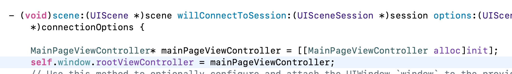

## iOS APP Screen启动过程

1. main.m 创建UIApplicationMain AppDelegate
2. AppDelegate通过info.plist查找启动scene，key为Application Scene Manifest
3. SceneDelegate.m负责创建UIWindow，这里有两种方式接入UIController

| 方式 | 描述 | 谁创建的 |
| :--- | :---: | ---: |
| 基于 Storyboard（默认方式） | 如果在 Info.plist 中指定了 Main Storyboard，系统会自动： 1. 加载并实例化 Main.storyboard 文件。 2. 找到 Storyboard 中被标记为 "Is Initial View Controller" 的 ViewController。 3. 将该 ViewController 的实例设置为 UIWindow 的 rootViewController。 | IKit 框架（基于 Info.plist 的配置） |
| 纯代码（手动方式） | 如果您移除了 Info.plist 中的 Storyboard 配置，您必须在代码中手动完成。 1. 手动创建 UIWindow 实例。 2. 手动实例化 ViewController，例如：[[ViewController alloc] init]。 3. 设置 self.window.rootViewController = myViewController;。 | 开发者代码（在 SceneDelegate 中） |

纯手工的方式：
1. info.plist 去掉 Main Storyboard
2. 