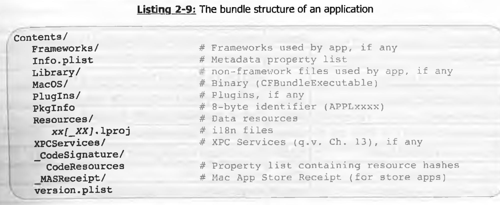

## part 1
### version
/System/Library/CoreServices/SystemVersion.plist
### kernel
BSD Mach(CMU 卡内基梅隆大学) IOKit
### AMFI
签名校验，授权检查entitlements，库签名检查
### plist
property list 文件。  
`+[NSDictionary dictionaryWithContentsOfFile:]`进行转化

plist
    - key
    - value
value可以是 string, integer, real, date, array, dict, true, false. 

`plutil -lint ~/Downloads/temp/persona.plist` 合法性校验。  
plutil可以进行编辑和转换。  

plist 二进制格式：  
magic： bplist00

```
(base) jesse@JessedeMacBook-Pro temp % xxd -l 0x10 -g 1 ~/Downloads/temp/persona.plist
00000000: 62 70 6c 69 73 74 30 30 d4 01 02 03 04 05 0c 0d  bplist00........
```

### bundle


### Frameworks

```
/System/Library/Frameworks
/System/Library/PrivateFrameworks
```