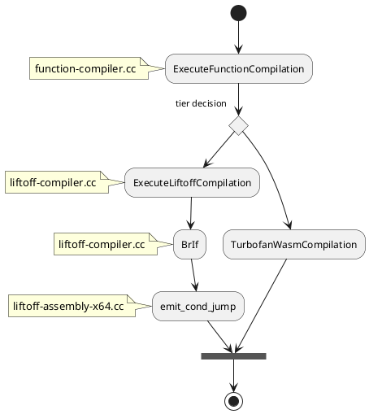

# NodeJS WASM compiler
## Introduce
NodeJs WASM Compiler contains `Liftoff` and `Turbofan`  
## flow

### uml: class diagram

```plantuml
@startuml
(*) --> "ExecuteFunctionCompilation"
note left: function-compiler.cc
if "tier decision" then 
-->"ExecuteLiftoffCompilation"
note left: liftoff-compiler.cc
-->"BrIf"
note left: liftoff-compiler.cc
-->"emit_cond_jump"
note left: liftoff-assembly-x64.cc
-->===B1===
else
-->"TurbofanWasmCompilation"
-->===B1===
endif
-->(*)
@enduml

```
