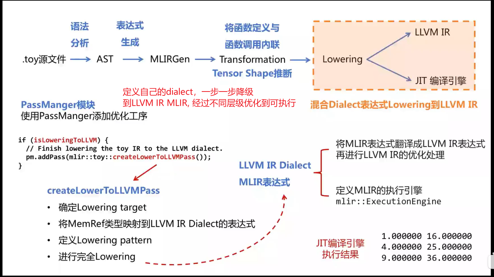

### build all
`cmake -S llvm -B build -G Ninja`  
`cd build`  
`ninja -j1`  


### build clang
`cmake -G Ninja -S clang -B build_clang -DLLVM_INCLUDE_TESTS=OFF -DCMAKE_BUILD_TYPE=Debug`   
`cd build_clang`  
`ninja -j1`  

### 带clang的整体编译
`cmake -S llvm -B build   -DCMAKE_BUILD_TYPE=Debug -DLLVM_ENABLE_PROJECTS="clang;clang-tools-extra;lld" -DLLVM_INCLUDE_TESTS=OFF `


### 通过backend测试调试CodeGen
以llvm-project/llvm/test/CodeGen/WebAssembly/i32.ll 为例子
```bash
llvm-as /Volumes/PortableSSD/workspace/llvm-project/llvm/test/CodeGen/WebAssembly/i32.ll -o i32.bc

llc -march=wasm32 --filetype=obj i32.bc -o i32.o  

wasm-ld --no-entry --export-all i32.o -o i32.wasm
```


### WASM LLC 调用栈信息
```
llc!(anonymous namespace)::WebAssemblyDAGToDAGISel::Select(llvm::SDNode*) (/Volumes/PortableSSD/workspace/llvm-project/llvm/lib/Target/WebAssembly/WebAssemblyISelDAGToDAG.cpp:123)

llc!llvm::SelectionDAGISel::DoInstructionSelection() (/Volumes/PortableSSD/workspace/llvm-project/llvm/lib/CodeGen/SelectionDAG/SelectionDAGISel.cpp:1352)
llc!llvm::SelectionDAGISel::CodeGenAndEmitDAG() (/Volumes/PortableSSD/workspace/llvm-project/llvm/lib/CodeGen/SelectionDAG/SelectionDAGISel.cpp:1121)

llc!llvm::SelectionDAGISel::SelectBasicBlock(llvm::ilist_iterator_w_bits<llvm::ilist_detail::node_options<llvm::Instruction, true, false, void, true, llvm::BasicBlock>, false, true>, llvm::ilist_iterator_w_bits<llvm::ilist_detail::node_options<llvm::Instruction, true, false, void, true, llvm::BasicBlock>, false, true>, bool&) (/Volumes/PortableSSD/workspace/llvm-project/llvm/lib/CodeGen/SelectionDAG/SelectionDAGISel.cpp:876)

llc!llvm::SelectionDAGISel::SelectAllBasicBlocks(llvm::Function const&) (/Volumes/PortableSSD/workspace/llvm-project/llvm/lib/CodeGen/SelectionDAG/SelectionDAGISel.cpp:1898)

llc!llvm::SelectionDAGISel::runOnMachineFunction(llvm::MachineFunction&) (/Volumes/PortableSSD/workspace/llvm-project/llvm/lib/CodeGen/SelectionDAG/SelectionDAGISel.cpp:614)

llc!(anonymous namespace)::WebAssemblyDAGToDAGISel::runOnMachineFunction(llvm::MachineFunction&) (/Volumes/PortableSSD/workspace/llvm-project/llvm/lib/Target/WebAssembly/WebAssemblyISelDAGToDAG.cpp:57)

llc!llvm::SelectionDAGISelLegacy::runOnMachineFunction(llvm::MachineFunction&) (/Volumes/PortableSSD/workspace/llvm-project/llvm/lib/CodeGen/SelectionDAG/SelectionDAGISel.cpp:374)

llc!llvm::MachineFunctionPass::runOnFunction(llvm::Function&) (/Volumes/PortableSSD/workspace/llvm-project/llvm/lib/CodeGen/MachineFunctionPass.cpp:108)

llc!llvm::FPPassManager::runOnFunction(llvm::Function&) (/Volumes/PortableSSD/workspace/llvm-project/llvm/lib/IR/LegacyPassManager.cpp:1406)

llc!llvm::FPPassManager::runOnModule(llvm::Module&) (/Volumes/PortableSSD/workspace/llvm-project/llvm/lib/IR/LegacyPassManager.cpp:1452)

llc!(anonymous namespace)::MPPassManager::runOnModule(llvm::Module&) (/Volumes/PortableSSD/workspace/llvm-project/llvm/lib/IR/LegacyPassManager.cpp:1521)

llc!llvm::legacy::PassManagerImpl::run(llvm::Module&) (/Volumes/PortableSSD/workspace/llvm-project/llvm/lib/IR/LegacyPassManager.cpp:539)

llc!llvm::legacy::PassManager::run(llvm::Module&) (/Volumes/PortableSSD/workspace/llvm-project/llvm/lib/IR/LegacyPassManager.cpp:1648)

llc!compileModule(char**, llvm::LLVMContext&) (/Volumes/PortableSSD/workspace/llvm-project/llvm/tools/llc/llc.cpp:737)

llc!main (/Volumes/PortableSSD/workspace/llvm-project/llvm/tools/llc/llc.cpp:397)

start (Unknown Source:0)
```

指令选择的主要逻辑放在了
SelectionDAGISel.cpp中。  
```C++
void SelectionDAGISel::SelectCodeCommon(SDNode *NodeToMatch,
                                        const unsigned char *MatcherTable,
                                        unsigned TableSize)
```

我们以DAG中MUL节点为例：

代码中，通过预先生成的MatcherTable，不断的向下寻找指令生成方式。 

```C++
BuiltinOpcodes Opcode =
        static_cast<BuiltinOpcodes>(MatcherTable[MatcherIndex++]);
```
在Webassembly的指令匹配定义文件中： WebAssemblyGenDAGISel.inc中：  
```
/* 13619*/ /*SwitchOpcode*/ 85|128,2/*341*/, TARGET_VAL(ISD::MUL),// ->13964
/* 13623*/  OPC_Scope, 22, /*->13647*/ // 3 children in Scope
/* 13625*/   OPC_RecordChild0, // #0 = $lhs
/* 13626*/   OPC_RecordChild1, // #1 = $rhs
/* 13627*/   OPC_SwitchType /*2 cases */, 7, /*MVT::i32*/7, // ->13637
/* 13630*/    OPC_MorphNodeTo1None, TARGET_VAL(WebAssembly::MUL_I32),
                  /*MVT::i32*/7, 2/*#Ops*/, 0, 1, 
              // Src: (mul:{ *:[i32] } I32:{ *:[i32] }:$lhs, I32:{ *:[i32] }:$rhs) - Complexity = 3
              // Dst: (MUL_I32:{ *:[i32] } I32:{ *:[i32] }:$lhs, I32:{ *:[i32] }:$rhs)
/* 13637*/   /*SwitchType*/ 7, /*MVT::i64*/8, // ->13646
/* 13639*/    OPC_MorphNodeTo1None, TARGET_VAL(WebAssembly::MUL_I64),
                  /*MVT::i64*/8, 2/*#Ops*/, 0, 1, 
              // Src: (mul:{ *:[i64] } I64:{ *:[i64] }:$lhs, I64:{ *:[i64] }:$rhs) - Complexity = 3
              // Dst: (MUL_I64:{ *:[i64] } I64:{ *:[i64] }:$lhs, I64:{ *:[i64] }:$rhs)
/* 13646*/   0, // EndSwitchType
```
一般是一个一个指令下来的。但是也会有跳转选择，比如在switch type中  
生成inc的源码在：  
WebAssemblyInstrInteger.td

```td
// WebAssemblyInstrFormats.td

class WebAssemblyInst<bits<32> inst, string asmstr, bit stack, bit is64>
  : StackRel, RegisterRel, Wasm64Rel, Instruction {
  bits<32> Inst = inst; // Instruction encoding.
  bit StackBased = stack;
  string BaseName = NAME;
  bit IsWasm64 = is64;
  string Wasm32Name = !subst("_A64", "_A32", NAME);
  let Namespace   = "WebAssembly";
  let Pattern     = [];
  let AsmString   = asmstr;
  // When there are multiple instructions that map to the same encoding (in
  // e.g. the disassembler use case) prefer the one where IsCanonical == 1.
  bit IsCanonical = 0;
}

// Normal instructions. Default instantiation of a WebAssemblyInst.
class NI<dag oops, dag iops, list<dag> pattern, bit stack,
         string asmstr = "", bits<32> inst = -1, bit is64 = false>
    : WebAssemblyInst<inst, asmstr, stack, is64> {
  dag OutOperandList = oops;
  dag InOperandList  = iops;
  let Pattern        = pattern;
  let Defs           = [ARGUMENTS];

multiclass I<dag oops_r, dag iops_r, dag oops_s, dag iops_s,
             list<dag> pattern_r, string asmstr_r = "", string asmstr_s = "",
             bits<32> inst = -1, bit is64 = false> {
  let isCodeGenOnly = 1 in
  def "" : NI<oops_r, iops_r, pattern_r, false, asmstr_r, inst, is64>;
  let BaseName = NAME in
  def _S : NI<oops_s, iops_s, [], true, asmstr_s, inst, is64>;
}

multiclass BinaryInt<SDNode node, string name, bits<32> i32Inst,
                     bits<32> i64Inst> {
  defm _I32 : I<(outs I32:$dst), (ins I32:$lhs, I32:$rhs), (outs), (ins),
                [(set I32:$dst, (node I32:$lhs, I32:$rhs))],
                !strconcat("i32.", !strconcat(name, "\t$dst, $lhs, $rhs")),
                !strconcat("i32.", name), i32Inst>;
  defm _I64 : I<(outs I64:$dst), (ins I64:$lhs, I64:$rhs), (outs), (ins),
                [(set I64:$dst, (node I64:$lhs, I64:$rhs))],
                !strconcat("i64.", !strconcat(name, "\t$dst, $lhs, $rhs")),
                !strconcat("i64.", name), i64Inst>;
}


defm MUL : BinaryInt<mul, "mul ", 0x6c, 0x7e>;
```

Machine Code指令添加的调用栈

```
llc!llvm::MachineBasicBlock::insert(llvm::MachineInstrBundleIterator<llvm::MachineInstr, false>, llvm::MachineInstr*) (/Volumes/PortableSSD/workspace/llvm-project/llvm/include/llvm/CodeGen/MachineBasicBlock.h:1039)

llc!llvm::InstrEmitter::EmitMachineNode(llvm::SDNode*, bool, bool, llvm::SmallDenseMap<llvm::SDValue, llvm::Register, 16u, llvm::DenseMapInfo<llvm::SDValue, void>, llvm::detail::DenseMapPair<llvm::SDValue, llvm::Register>>&) (/Volumes/PortableSSD/workspace/llvm-project/llvm/lib/CodeGen/SelectionDAG/InstrEmitter.cpp:1140)

llc!llvm::InstrEmitter::EmitNode(llvm::SDNode*, bool, bool, llvm::SmallDenseMap<llvm::SDValue, llvm::Register, 16u, llvm::DenseMapInfo<llvm::SDValue, void>, llvm::detail::DenseMapPair<llvm::SDValue, llvm::Register>>&) (/Volumes/PortableSSD/workspace/llvm-project/llvm/lib/CodeGen/SelectionDAG/InstrEmitter.h:145)

llc!llvm::ScheduleDAGSDNodes::EmitSchedule(llvm::MachineInstrBundleIterator<llvm::MachineInstr, false>&)::$_0::operator()(llvm::SDNode*, bool, bool, llvm::SmallDenseMap<llvm::SDValue, llvm::Register, 16u, llvm::DenseMapInfo<llvm::SDValue, void>, llvm::detail::DenseMapPair<llvm::SDValue, llvm::Register>>&) const (/Volumes/PortableSSD/workspace/llvm-project/llvm/lib/CodeGen/SelectionDAG/ScheduleDAGSDNodes.cpp:873)

llc!llvm::ScheduleDAGSDNodes::EmitSchedule(llvm::MachineInstrBundleIterator<llvm::MachineInstr, false>&) (/Volumes/PortableSSD/workspace/llvm-project/llvm/lib/CodeGen/SelectionDAG/ScheduleDAGSDNodes.cpp:964)

llc!llvm::SelectionDAGISel::CodeGenAndEmitDAG() (/Volumes/PortableSSD/workspace/llvm-project/llvm/lib/CodeGen/SelectionDAG/SelectionDAGISel.cpp:1152)
llc!llvm::SelectionDAGISel::SelectBasicBlock(llvm::ilist_iterator_w_bits<llvm::ilist_detail::node_options<llvm::Instruction, true, false, void, true, llvm::BasicBlock>, false, true>, llvm::ilist_iterator_w_bits<llvm::ilist_detail::node_options<llvm::Instruction, true, false, void, true, llvm::BasicBlock>, false, true>, bool&) (/Volumes/PortableSSD/workspace/llvm-project/llvm/lib/CodeGen/SelectionDAG/SelectionDAGISel.cpp:876)
llc!llvm::SelectionDAGISel::SelectAllBasicBlocks(llvm::Function const&) (/Volumes/PortableSSD/workspace/llvm-project/llvm/lib/CodeGen/SelectionDAG/SelectionDAGISel.cpp:1898)
llc!llvm::SelectionDAGISel::runOnMachineFunction(llvm::MachineFunction&) (/Volumes/PortableSSD/workspace/llvm-project/llvm/lib/CodeGen/SelectionDAG/SelectionDAGISel.cpp:614)
llc!(anonymous namespace)::WebAssemblyDAGToDAGISel::runOnMachineFunction(llvm::MachineFunction&) (/Volumes/PortableSSD/workspace/llvm-project/llvm/lib/Target/WebAssembly/WebAssemblyISelDAGToDAG.cpp:57)
llc!llvm::SelectionDAGISelLegacy::runOnMachineFunction(llvm::MachineFunction&) (/Volumes/PortableSSD/workspace/llvm-project/llvm/lib/CodeGen/SelectionDAG/SelectionDAGISel.cpp:374)
llc!llvm::MachineFunctionPass::runOnFunction(llvm::Function&) (/Volumes/PortableSSD/workspace/llvm-project/llvm/lib/CodeGen/MachineFunctionPass.cpp:108)
llc!llvm::FPPassManager::runOnFunction(llvm::Function&) (/Volumes/PortableSSD/workspace/llvm-project/llvm/lib/IR/LegacyPassManager.cpp:1406)
llc!llvm::FPPassManager::runOnModule(llvm::Module&) (/Volumes/PortableSSD/workspace/llvm-project/llvm/lib/IR/LegacyPassManager.cpp:1452)
llc!(anonymous namespace)::MPPassManager::runOnModule(llvm::Module&) (/Volumes/PortableSSD/workspace/llvm-project/llvm/lib/IR/LegacyPassManager.cpp:1521)
llc!llvm::legacy::PassManagerImpl::run(llvm::Module&) (/Volumes/PortableSSD/workspace/llvm-project/llvm/lib/IR/LegacyPassManager.cpp:539)
llc!llvm::legacy::PassManager::run(llvm::Module&) (/Volumes/PortableSSD/workspace/llvm-project/llvm/lib/IR/LegacyPassManager.cpp:1648)
llc!compileModule(char**, llvm::LLVMContext&) (/Volumes/PortableSSD/workspace/llvm-project/llvm/tools/llc/llc.cpp:737)
llc!main (/Volumes/PortableSSD/workspace/llvm-project/llvm/tools/llc/llc.cpp:397)
start (Unknown Source:0)
```


LLVM中，将指令结果写在流中的流配置位置：  
`CodeGenTargetMachineImpl::addPassesToEmitFile`

TargetRegister.h

```C++
AsmPrinter *createAsmPrinter(TargetMachine &TM,
                               std::unique_ptr<MCStreamer> &&Streamer) const {
    if (!AsmPrinterCtorFn)
      return nullptr;
    return AsmPrinterCtorFn(TM, std::move(Streamer));
  }
```

基本上每个平台都会实现自己的指令打印程序
如webassembly:

```C++
void WebAssemblyAsmPrinter::emitInstruction(const MachineInstr *MI) {
  LLVM_DEBUG(dbgs() << "EmitInstruction: " << *MI << '\n');
  WebAssembly_MC::verifyInstructionPredicates(MI->getOpcode(),
                                              Subtarget->getFeatureBits());

  switch (MI->getOpcode()) {
    ...
```

通过WebAssemblyGenMCCodeEmitter.inc将MI指令进行翻译，翻译成对应的WASM二进制码：

```C++
//WebAssemblyMCCodeEmitter::getBinaryCodeForInstr
  const unsigned opcode = MI.getOpcode();
  uint64_t Value = InstBits[opcode];
  uint64_t op = 0;
```

像`i32.const 42` 转换成机器码应该是`41 2A`
后面会跟一个立即数，这时候在：
`WebAssemblyMCCodeEmitter::encodeInstruction `
中会有这部分逻辑：
```C++
for (unsigned I = 0, E = MI.getNumOperands(); I < E; ++I) {
    const MCOperand &MO = MI.getOperand(I);
    if (MO.isReg()) {
      /* nothing to encode */

    } else if (MO.isImm()) {
        ...

```


### LLVM MLIR


