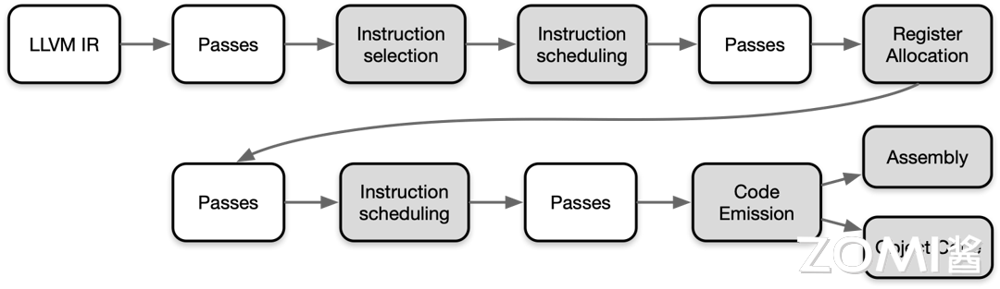

指令调度（Instruction Scheduling）是编译器优化的一部分，旨在通过重新排序程序中的指令来提高计算机程序的性能。这个过程通常包括前寄存器分配（Pre-Register Allocation, Pre-RA）调度和后寄存器分配（Post-Register Allocation, Post-RA）调度两个阶段。

## 前寄存器分配调度
在前寄存器分配调度（Pre-RA Scheduling）阶段，编译器会对程序中的指令进行排序，同时尝试发现能够并行执行的指令。这种并行执行可以提高程序的吞吐量和执行效率。在现代计算机体系结构中，由于存在多级缓存和流水线等技术，指令调度可以帮助减少指令执行的停顿，并充分利用硬件资源。

一种常见的技术是基于数据依赖性进行指令调度。编译器会分析指令之间的数据依赖关系，然后将独立的指令重排序以并行执行，而不会改变程序的语义。这种优化可以通过重排指令来避免数据冒险（Data Hazard）和控制冒险（Control Hazard），从而提高程序的性能。

在指令调度的过程中，编译器可能会引入一些额外的指令（如填充指令）或调整指令的执行顺序，以最大程度地利用计算资源。例如，可以调整指令的执行顺序，以便在执行整数运算的同时进行浮点运算，或者在内存访问受限时插入其他计算指令。指令最终将被转换为三地址表示的 MachineInstr。

## 寄存器分配
寄存器分配（Register Allocation）是编译器优化的重要步骤之一，其主要任务是将虚拟寄存器分配到有限数量的物理寄存器上，从而减少对内存的访问，提高程序的性能和效率。在 LLVM IR 中，寄存器分配的过程较为特殊，因为 LLVM IR 寄存器集是无限的，直到实施寄存器分配为止。

在寄存器分配中，编译器会尝试将虚拟寄存器映射到物理寄存器上，以便在执行指令时能够直接访问这些寄存器而不必通过内存。然而，由于物理寄存器数量有限，当虚拟寄存器的数量超过物理寄存器时，就需要使用一些策略来处理这种溢出（Spill）情况，将部分寄存器的内容存储到内存中，并在需要时重新加载。

寄存器分配算法可以分为多种类型，常见的包括：

贪心寄存器分配（Greedy Register Allocation）：这是一种简单直接的算法，它会顺序地将虚拟寄存器分配给可用的物理寄存器，一旦物理寄存器被占用完时就进行溢出处理。虽然效率较高，但可能会导致局部最优解。

迭代寄存器合并（Iterated Register Coalescing）：该算法尝试合并虚拟寄存器，使得原本需要分配到不同物理寄存器的虚拟寄存器可以合并到同一个物理寄存器上。这样可以减少溢出和重加载的次数，提高程序性能。

图着色（Graph Coloring）：基于图的寄存器分配算法，将寄存器分配问题转化为图着色问题。通过建立虚拟寄存器之间的冲突图，尝试对图进行着色，从而确定哪些虚拟寄存器可以分配到同一个物理寄存器上，以最小化溢出次数。

寄存器分配在编译器优化中扮演着至关重要的角色，通过有效的寄存器分配算法可以显著提高程序的执行效率和性能。

## 后寄存器分配调度
在后寄存器分配调度（Post-RA Scheduling）阶段，编译器对已经分配了寄存器的机器代码进行进一步优化。此阶段的目标是最大化硬件资源的利用，减少指令执行的停顿，并优化寄存器的使用。具体包括：

处理资源冲突：调整指令顺序以避免资源冲突，例如寄存器使用冲突、流水线停顿等。

插入填充指令：在必要时插入填充指令（如 NOP 指令）以消除潜在的流水线停顿。

优化执行顺序：通过重新排列指令，使得整数运算、浮点运算、内存访问等能够并行执行，从而提高性能。

以上是对指令调度和寄存器分配的基本介绍和常见算法。通过有效的指令调度和寄存器分配，可以显著提高程序的执行效率和性能。