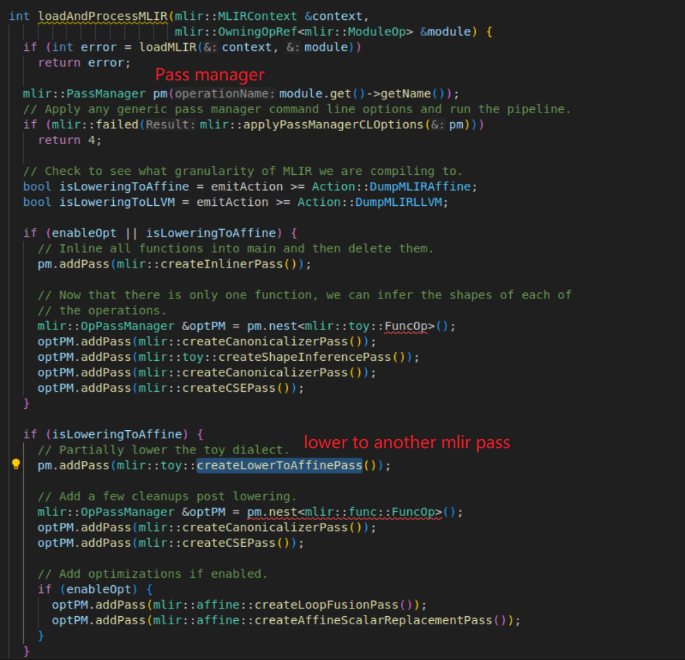
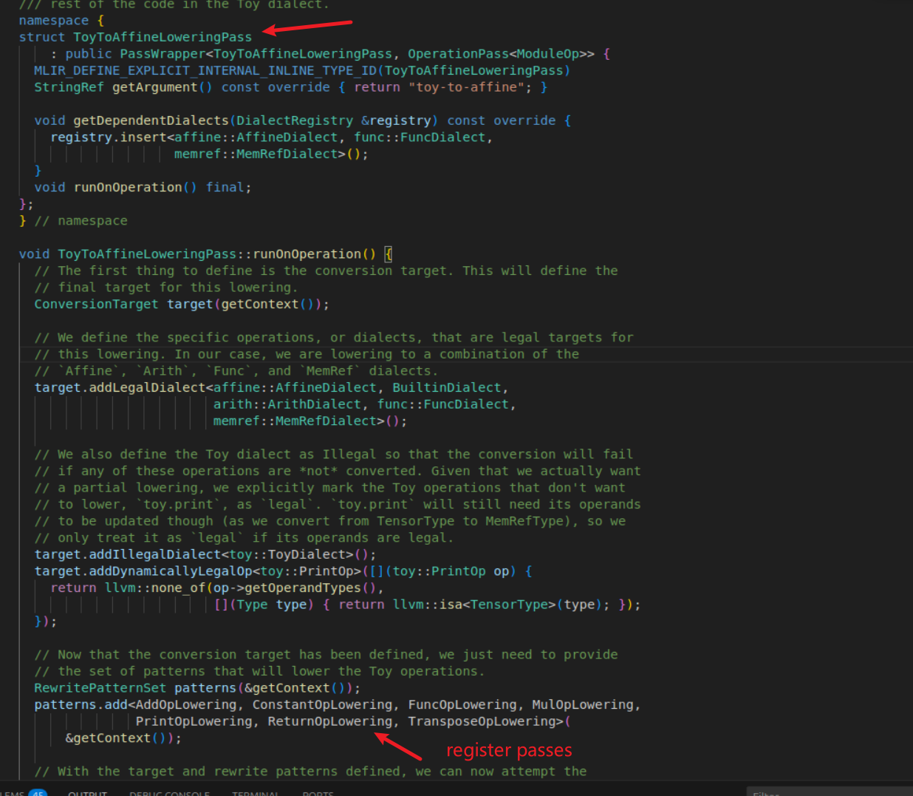
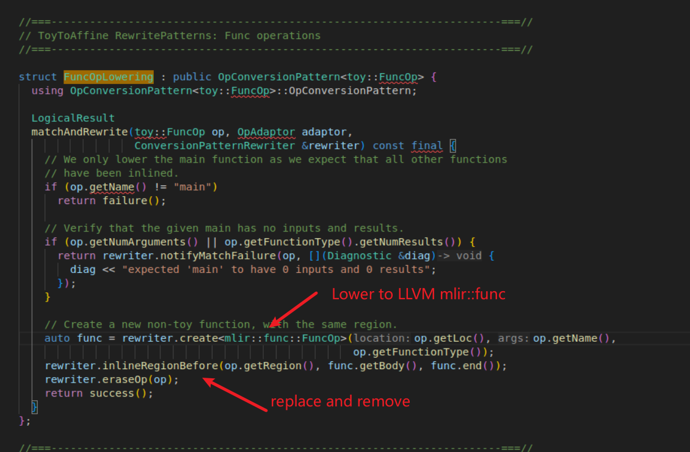
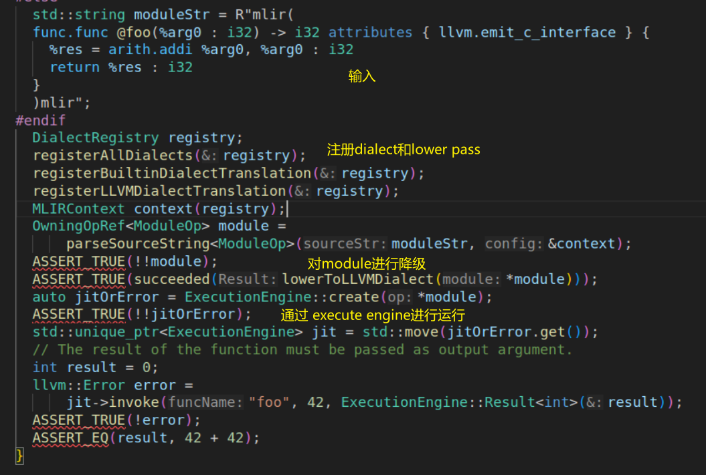
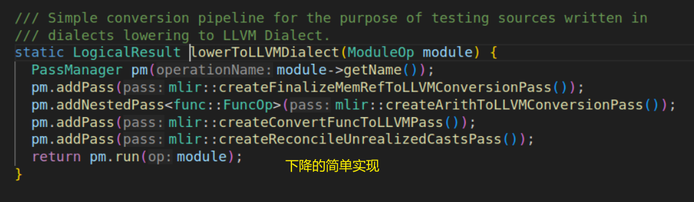

# toy mlir 的完整lower流程

### table gen cmakelist
```
# Most dialects should use add_mlir_dialect().  See examples/standalone.
set(LLVM_TARGET_DEFINITIONS Ops.td)
mlir_tablegen(Ops.h.inc -gen-op-decls)
mlir_tablegen(Ops.cpp.inc -gen-op-defs)
mlir_tablegen(Dialect.h.inc -gen-dialect-decls)
mlir_tablegen(Dialect.cpp.inc -gen-dialect-defs)
add_public_tablegen_target(ToyCh7OpsIncGen)

# Most dialects should use add_mlir_interfaces().
set(LLVM_TARGET_DEFINITIONS ShapeInferenceInterface.td)
mlir_tablegen(ShapeInferenceOpInterfaces.h.inc -gen-op-interface-decls)
mlir_tablegen(ShapeInferenceOpInterfaces.cpp.inc -gen-op-interface-defs)
add_public_tablegen_target(ToyCh7ShapeInferenceInterfaceIncGen)

```

### project cmakelist
```
# This chapter depends on JIT support enabled.
if(NOT MLIR_ENABLE_EXECUTION_ENGINE)
  return()
endif()

# For a better template to copy, see examples/standalone
include_directories(include)
add_subdirectory(include)

set(LLVM_LINK_COMPONENTS
  Core
  Support
  nativecodegen
  OrcJIT
  )

set(LLVM_TARGET_DEFINITIONS mlir/ToyCombine.td)
mlir_tablegen(ToyCombine.inc -gen-rewriters)
add_public_tablegen_target(ToyCh7CombineIncGen)

add_toy_chapter(toyc-ch7
  toyc.cpp
  parser/AST.cpp
  mlir/MLIRGen.cpp
  mlir/Dialect.cpp
  mlir/LowerToAffineLoops.cpp
  mlir/LowerToLLVM.cpp
  mlir/ShapeInferencePass.cpp
  mlir/ToyCombine.cpp

  DEPENDS
  ToyCh7ShapeInferenceInterfaceIncGen
  ToyCh7OpsIncGen
  ToyCh7CombineIncGen
  )

include_directories(${CMAKE_CURRENT_BINARY_DIR})
include_directories(${CMAKE_CURRENT_BINARY_DIR}/include/)
get_property(dialect_libs GLOBAL PROPERTY MLIR_DIALECT_LIBS)
get_property(conversion_libs GLOBAL PROPERTY MLIR_CONVERSION_LIBS)
get_property(extension_libs GLOBAL PROPERTY MLIR_EXTENSION_LIBS)
target_link_libraries(toyc-ch7
  PRIVATE
    ${dialect_libs}
    ${conversion_libs}
    ${extension_libs}
    MLIRAnalysis
    MLIRBuiltinToLLVMIRTranslation
    MLIRCallInterfaces
    MLIRCastInterfaces
    MLIRExecutionEngine
    MLIRFunctionInterfaces
    MLIRIR
    MLIRLLVMCommonConversion
    MLIRLLVMToLLVMIRTranslation
    MLIRMemRefDialect
    MLIRParser
    MLIRPass
    MLIRSideEffectInterfaces
    MLIRTargetLLVMIRExport
    MLIRTransforms
    )

```

### create context
```C++
  mlir::DialectRegistry registry;
  mlir::func::registerAllExtensions(registry);
  mlir::LLVM::registerInlinerInterface(registry);

  mlir::MLIRContext context(registry);
  mlir::OwningOpRef<mlir::ModuleOp> module;
```

### lower






### 最简单lower test case

