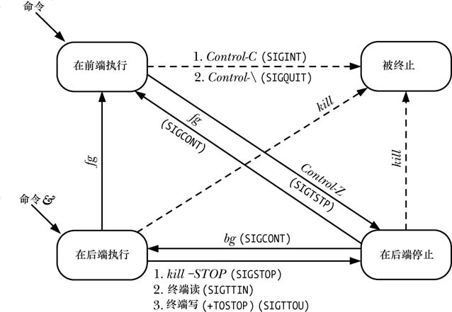

### 后台运行一个进程
`sleep 60 &`
### 查看终端所有的job
`jobs`
### 将一个后台进程放入前台
`fg %1`
### 终止一个后台进程
`kill -STOP %1`
### 读取后台程序的输出
`fg`
### 将一个前端进程转入后端执行（用ctrl-z将程序放入后台停止状态）
```
jesse@Dev:~/workspace/wasm-compiler$ sleep 60
^Z
[1]+  Stopped                 sleep 60
jesse@Dev:~/workspace/wasm-compiler$ jobs
[1]+  Stopped                 sleep 60
jesse@Dev:~/workspace/wasm-compiler$ bg %1
[1]+ sleep 60 &
jesse@Dev:~/workspace/wasm-compiler$ jobs
[1]+  Running                 sleep 60 &

```



### 当前shell的进程号
`echo $$`
### 孤儿进程组
孤儿进程组是非常重要的，因为在这个组外没有任何进程能够监控组中所有
被停止的进程的状态并总是能够向这些被停止的进程发送 SIGCONT 信号来重启它们。这样就
可能导致这种被停止的进程永远残留在系统中。为了避免这种情况的发生，当一个拥有被停
止的成员进程的进程组变成孤儿进程组时，进程组中的所有成员都会收到一个 SIGHUP 信号，
后面跟着一个 SIGCONT 信号，这样就能通知它们变成了孤儿进程并确保重启它们。